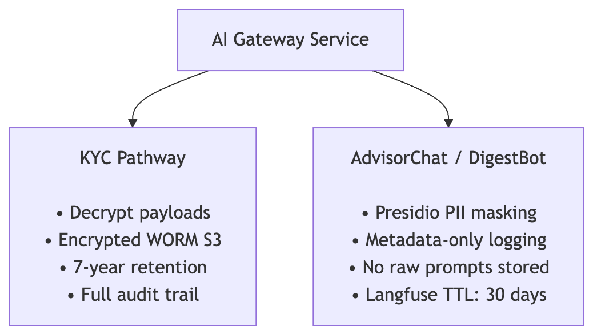
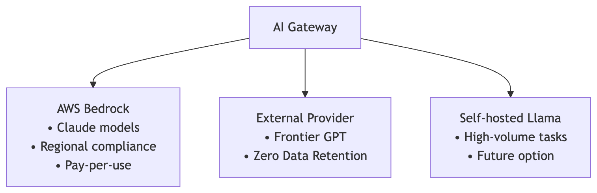

# AI Platform Architecture: Cost, Governance, and Safety Blueprint

## 1. Executive Summary & Design Philosophy
This document establishes the architectural blueprint for the AI Platform at Scalable Fictional. The platform serves as the single, sanctioned, governed gateway for all LLM interactions across our six product teams. 

Our core philosophy balances **developer enablement** (via self-service GitOps) with **operational control** (structural cost controls, strict regulatory compliance, and agentic guardrails). We treat telemetry and governance as platform-level invariants rather than application-level choices.

## 2. Cost Governance
Based on a 30-day analysis of our model spend, we have identified two severe financial risks:
1. **Unattributed Spend (Shadow IT):** The personal key `key-personal-mhuber` spent over $2,000 without any team metadata, and some keys are missing team association entirely.
2. **Runaway Agentic Loops:** The `DevAgent` workload experienced exponential spend spikes (peaking at $1,826.88 on Nov 24), indicative of infinite tool-execution loops.

### Proposed Controls
* **Strict Metadata Enforcement:** The gateway will reject any API request where the API key is not mapped to an active team in the configuration database.
* **Daily and Monthly Team Budgets (Hard Caps):** 
* Budgets are configured declaratively.
  * When a team reaches **75%** of their daily budget, an automated warning is sent to their Slack channel.
  * When they reach **100%**, the gateway triggers a policy action:
    * **Graceful Downgrade (e.g., AdvisorChat, DigestBot):** The gateway transparently rewires the route to a cheaper model (e.g., Sonnet to Haiku, or GPT-5.4 to GPT-5.4-mini) and injects a header (`X-Platform-Downgraded: true`) so the application can adjust its UX.
    * **Hard Stop (e.g., DevAgent, Research):** The gateway immediately blocks requests with a `402 Payment Required` error to prevent runaway costs.

* **Agentic Runaway Circuit Breaker:** 
The gateway tracks consecutive rapid calls within a single trace ID. If an agent (like `DevAgent`) initiates more than 15 tool-execution iterations or consumes more than $10 within a single session, the gateway trips a circuit breaker, terminates the session, and logs a critical event.


## 3. Data Governance & Regulatory Compliance
As a regulated digital banking platform, we must satisfy the Data Protection Officer (DPO) and Legal regarding data residency and auditability.

Here is the target data flow architecture for our compliance pathways:



### Proposed Controls:
* **Differentiated Logging and Retention Zones:**
  * **KYC Pathway (Audit-First):** Raw inputs, outputs, and metadata are written to an encrypted, write-once-read-many (WORM) S3 bucket with Object Lock enabled. Retention is set to 7 years to meet audit requirements. Payload decryption keys are tightly restricted.
  * **AdvisorChat Pathway (Privacy-First):** Handles customer Q&A. The gateway runs a lightweight, local PII masking engine (e.g., Microsoft Presidio) to redact German tax IDs, IBANs, and names *before* forwarding to the provider. The gateway database stores only metadata (tokens, costs). Raw traces in self-hosted Langfuse have a strict 30-day TTL.
* **Deterministic Trace Reconstruction:** 
  Each trace is signed with a SHA-256 HMAC generated from the input, output, and the platform's private key. This ensures that any past interaction presented to the company can be verified as authentic and unaltered.

## 4. Agentic Safety & MCP Security
### Proposed Architecture:
* **The Dual-Gateway Boundary:** 
  We separate LLM call routing from tool execution. The AI Gateway manages the model handshake. When the model emits a tool call, the client routes that execution through a dedicated **MCP Security Proxy**.
* **Action Classification & Human-In-The-Loop (HITL):**
  We classify tools into three security classes:
  1. **Read (Low Risk):** e.g., `read_wiki_page`, `list_tickets`. Executed automatically.
  2. **Write/Mutate (Medium Risk):** e.g., `create_ticket`, `update_wiki`. Allowed within a rolling daily volume budget (e.g., max 50 updates per user/day).
  3. **Destructive (High Risk):** e.g., `delete_repository`, `drop_table`. These require the MCP Proxy to pause execution, generate a secure, short-lived Slack interactive approval button for the user or team lead, and resume only upon cryptographic confirmation.
* **Forensic Auditing:** 
  The MCP Proxy logs the exact system context, the prompt that triggered the tool, the tool arguments, and the identity of the executing agent to an immutable ledger.

## 5. Observability (SLIs & SLOs)
To monitor platform health without exposing PII in Datadog, we implement a platform-owned SLI/SLO dashboard.

### SLI Definitions:
1. **API Availability:** `(Successful Requests - Upstream 4xx/5xx - Gateway Errors) / Total Requests`
2. **Streaming Latency (TTFT):** Duration between request start and the first token chunk.
3. **Cache Efficiency:** `Cache Read Tokens / Total Input Tokens`
4. **Error Rate:** Percentage of failed responses, split by Provider Throttling vs. Local Gateway Faults.

### SLO Targets:
* **AdvisorChat:** 99.5% availability, p95 TTFT < 500ms, p95 total duration < 3.0s.
* **DigestBot:** 95.0% availability, latency targets are relaxed (asynchronous).

### Alerting vs. Paging:
* **Page-Worthy (On-Call Action Required):**
  * Global gateway availability falls below 98.0% over a 5-minute window.
  * Rapid spend anomalies (e.g., a single key spends > $200 in 10 minutes, indicating a loop).
  * Upstream provider error rate (e.g., Bedrock in Frankfurt) exceeds 5% and fallback fails.
* **Alert-Only (Ticket Generated):**
  * Degradation of p99 TTFT on a specific model.
  * Individual team budget reaching 90% threshold.
  * Incremental increase in token size anomalies (indicating context bloat).

## 6. Self-Service GitOps Onboarding
We eliminate ticketing bottlenecks by defining teams, models, and budgets in a centralized Git repository.

### Onboarding Workflow:
1. A developer submits a Pull Request modifying a team configuration file (e.g., `teams/marketing.yaml`):
   ```yaml
   team_name: Marketing
   owner_email: marketing-eng@scalable.capital
   data_classification: public
   daily_budget_usd: 50.00
   default_model: claude-haiku-4-5
   allowed_models:
     - claude-haiku-4-5
     - gpt-5.4-mini
    ```
2. CI/CD Validations:
* Validates YAML structure against a strict JSON schema.
* Checks that the requested budget does not exceed the department's allocated hard limit.
* Confirms that all listed models are present in the global registry.

3. Automated Provisioning:
* Upon merging, a GitHub Action runs a Terraform plan applying changes to the LiteLLM configuration database and registers the API key securely in AWS Secrets Manager.

## 7. Model Sourcing Position

* **Continue with Bedrock (Frankfurt) for Claude:** Anthropic models are our workhorse for reasoning-heavy workloads (AdvisorChat, KYC). AWS Bedrock provides enterprise-grade SLAs, pay-per-use scaling, and regional regulatory compliance in Germany.
* **Continue with External Provider under ZDR:** Required for frontier capabilities (GPT-5.4) for DevAgent and advanced workloads, governed under a strict enterprise Zero Data Retention agreement.
* **Managed Open-Weight Models (Bedrock) over Self-Hosting:**
  * Self-hosting open-weight models (like Llama-3-70B) on AWS Fargate or SageMaker GPUs introduces massive operational overhead: cold starts, auto-scaling complexities, and high baseline costs.
  * The Math: A single ml.g5.12xlarge SageMaker instance (needed to host Llama-3-70B with reasonable latency) costs
   ~7.09/hour, or **5100/month** in raw, fixed compute cost.
  * Our bursty workloads (e.g., Research and Marketing) run in short sessions. Paying for idle GPU time is highly inefficient compared to Bedrock's serverless pay-per-token pricing for managed open-weight models.
  * Recommendation: **Defer self-hosting**. Consume open-weight models via Bedrock's serverless endpoints for low-tier tasks (such as DigestBot) to lower token costs, and evaluate self-hosting only when a single model's continuous utilization justifies dedicated GPU instances.  

## 8. Implementation Roadmap & Deferred Alternatives
### Six-Month Roadmap:
**1. Month 1-2 (Phase 1):** Implement GitOps configuration management, strict key-to-team database mapping, and basic budget caps. Integrate the **Option D SLI monitoring service**.

**2. Month 3-4 (Phase 2):** Introduce the MCP Security Proxy with human-in-the-loop validation for destructive calls.

**3. Month 5-6 (Phase 3):** Roll out the local PII masking gateway middleware and migrate low-priority batch tasks to managed open-weight models on Bedrock to optimize costs.
### Rejected Alternatives:
Direct DB-Writes from Gateway: We rejected writing metric events directly from the AI Gateway's request handler to Datadog. This adds processing overhead and risks leaking raw prompt PII. Instead, we pull traces asynchronously from the Langfuse database using our background SLI service.
